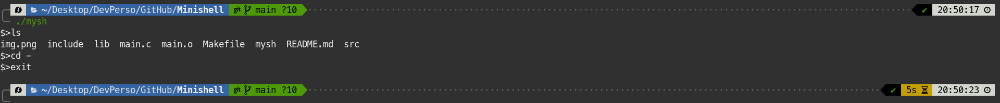

# Minishell project :desktop_computer:

## Done by Melissa - Epitech 2022 :mortar_board:

### Overview

This project is a part of the **first** year of Epitech. <br>
I had **2 weeks** to complete it. :spiral_calendar: <br>

The goal of this project was to recreate a tcsh shell. <br>

### Features

To quit the program, you can write `exit` in the program or do a `ctrl + d`.

### Running the project locally

From the repo:

- Clone this repostitory locally
- Run `make` in your bash / command line
- Run `./mysh`

To try this program, you can to use this **command** to automatically play the game and when you quit it, clean the repository:
```bash
make && ./mysh && make fclean
```

An output you can get from this program can be:



Here are the different **tools** and **languages** I used to make this project: :hammer_and_wrench:

[](https://github.com/tandpfun/skill-icons)
